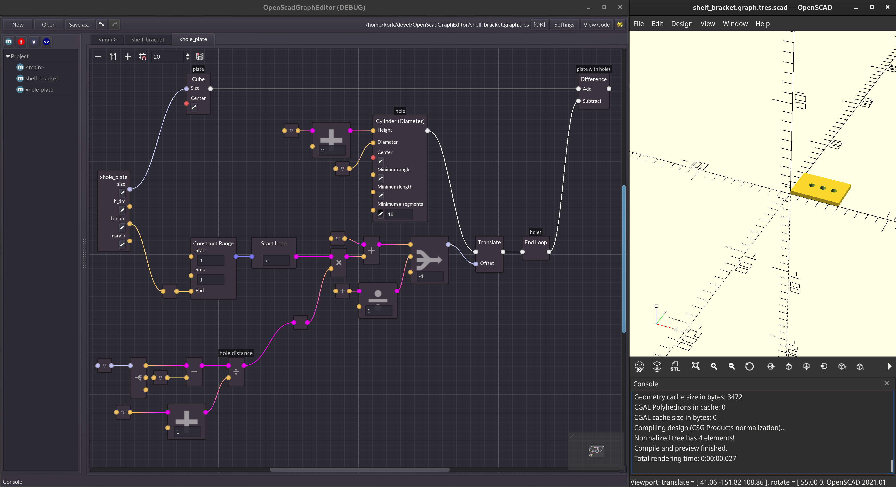

# OpenSCAD Graph Editor

<!--suppress HtmlDeprecatedAttribute -->

_This is an early version. It works reasonably well but it has not seen a lot of use and testing so it is not yet recommended for productive use.  You are welcome to try it out and give feedback at this stage. Please also check the [FAQ](manual/faq.md) if you have problems._

OpenSCAD Graph Editor is a graphical user interface for [OpenSCAD](https://openscad.org) that allows you to create 3D models by connecting nodes in a graph. The editor will automatically generate OpenSCAD code for you. It integrates with the OpenSCAD program so you can preview your models in real time while you are editing the graph. Please check the [manual](manual/manual.md) to find out how to install and use the program.

## Features

- Supports all [built-in](https://openscad.org/cheatsheet/) OpenSCAD functions and modules.
- Supports creating custom functions and modules for re-use and cleaner graphs.
- Full refactoring support (e.g. rename functions and modules, add, remove and reorder parameters).
- Live preview of the model in OpenSCAD.
- Allows to use functions and modules of text-based OpenSCAD [libraries](https://openscad.org/libraries.html) (e.g. BOSL, BOLTS, Round Anything or your own libraries) as part of the graph.
- Allows adding documentation to functions and modules which will be part of the generated OpenSCAD code.
- Built-in help for every node in the graph, including custom nodes.
- Produces clean and readable OpenSCAD code.
