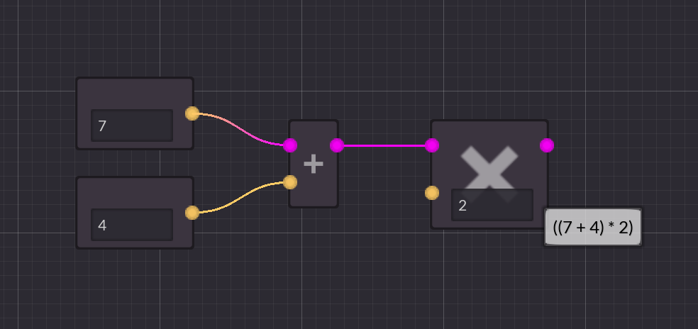

# OpenSCAD Graph Editor Manual

_This manual is currently being written._

## Introduction
OpenSCAD is a 3D CAD program that can be used to create 3D models through scripting. The OpenSCAD Graph Editor is a graphical user interface for OpenSCAD that allows you to create 3D models by connecting nodes in a graph. The editor will automatically generate OpenSCAD code for you.

## Installation & Setup

You can download the latest release of the OpenSCAD Graph Editor from [GitHub](https://github.com/derkork/openscad-graph-editor/releases) extract it to a convenient location and run the program. No installation procedure is required. 

### Prerequisites for live preview
If you want to have a live preview while you are editing, you will also need to download and install [OpenSCAD](https://openscad.org/downloads.html). Then arrange the windows of OpenSCAD Graph Editor and OpenSCAD so that they are next to each other (or place them on different monitors if you happen to have a multi-monitor setup). It is recommended that you hide the editor in the OpenSCAD window (_Window_ -> _Hide Editor_).

After this, you can set up the location of OpenSCAD in the settings menu:

1. Press the _Settings_ button.
2. In the _Settings_ dialog, press the _Select_ button. A file dialog will appear. Select the OpenSCAD executable. Where this is located depends on how you installed OpenSCAD and which operating system you are using.
3. Press the _Open_ button to select the OpenSCAD executable.
4. Press the _OK_ button to close the settings dialog and save the settings.

You are now ready to use the OpenSCAD Graph Editor.

## Getting Started
### Starting a new project

When you start OpenSCAD Graph Editor, it will show a blank graph. You can already add nodes to the graph but live preview is not enabled until you actually save the project somewhere. This is because live preview requires that OpenSCAD code is generated and written to a file so that the OpenSCAD executable can read it and produce a live preview. So you should immediately save the project somewhere. You can save it by pressing the _Save as..._ button.  After the project is saved you can start live preview by pressing the OpenSCAD icon in the top right corner of the editor, provided that you have set it up correctly. If you haven't set this up yet, check the previous section.

From now on you will no longer need to manually save the project. The editor will automatically save the project when you change something in the graph. This will also trigger a refresh in the live preview.

### Nodes
The editor is a graph editor. It allows you to create 3D models by connecting nodes in a graph. Nodes are connected through ports (these are the colored circles left and right of the node). A node can have input ports - the ones on the left - and output ports - the ones on the right. This, for example is a _Cube_ node:

It has two input ports which allow you to configure the size and position of the cube and it has one output port where the node will output the resulting geometry. You may notice that the ports have different colors. These colors indicate what kind of data the port can accept (for input ports) and what kind of data the port will output (for output ports).

The following colors are used:

- _Purple_ - any value except geometry
- _Green_ - a number
- _Red_ - a boolean value (true or false)
- _Very Light Blue_ - a vector2 (a combination of 2 numbers), used for 2D coordinates
- _Light Blue_ - a vector3 (a combination of 3 numbers), used for 3D coordinates
- _Blue_ - a vector (a list of arbitrary length with arbitrary contents)
- _Yellow_ - a string (a text value)
- _White_ - geometry (a 2D or 3D object)

### Adding nodes
There are multiple ways to add nodes to the graph. You can right-click on a free space in the graph to open the _Add Node_ dialog. This contains a list of all available nodes. You can then type the name of the node you want to add and press `Enter` or double-click the node in the list to add it to the graph. All built-in nodes come with a unique short name which is indicated in square brackets behind the node's full name. For example the _Cube_ node has the short name _Cbe_. This feature allows you to quickly add nodes by typing their short name and pressing `Enter`.

If you already have a node in your graph, you can also drag from one of its ports (input or output) to a free space in the graph. This will also open the _Add Node_ dialog. In addition it will filter the selection of nodes to only show the ones that can be connected to the port you dragged from. If for some reason you don't want the list filtered, you can uncheck the _Filter by current context_ checkbox in the _Add Node_ dialog.

After you have selected a node from the list the node will be added to the graph and will automatically be connected to the port you dragged from. 

### Getting help for a node

Sometimes it may not be immediately obvious what a node does and what needs to be connected to its inputs and outputs. You can get help for any node by selecting it and then pressing the `F1` key on your keyboard. This will show a help screen for that node which describes what the node does.

### Connecting nodes

You can connect nodes by dragging one of output ports of a node to an input port of another node or vice versa. Every connection must be made between an input port and an output port. The connections indicate how data flows between nodes. **Data always flows from left to right.** This is true for all port types (including geometry). Let's explore this in a few examples:

Here you have two nodes representing the numbers 7 and 4. Their output goes into the two input ports of an addition node (`+`). This node will output the sum of the two numbers from its input ports. Then its output is connected to one input port of a multiplication node (`*`). This node will output the product of the two numbers from its input ports. You can see that nothing is connected to the second input port of the multiplication node. When you connect nothing to a node's input port, depending on the type of the port you can enter values directly. In this case `2`  was entered, so the multiplication node will now multiple the result from the addition node by 2. You can hover over nodes to see what the node will produce. In this example the whole chain of nodes will produce the expression `((7 + 4) * 2)`.

Lets check another example which involves geometry:

Here we have two nodes which create cube(oid)s. The first creates a cube with a size of 2x2x2 units. The second node creates a cuboid with a size of 1x3x1 units. We then add a _Difference_  node which subtracts the second cube from the first. As a result we get a 2x2x2 cube with a hole in the middle. In the example screenshot the second cube has been given a debug modifier so you can see it in translucent red in the 3D view. Without this modifier it would not be visible. Again you can see that **data always flows from left to right**. The two cubes on the left are the input for the _Difference_ node on the right and the _Difference_ node's output will contain new data produced from its inputs.

#### Connecting geometry ports

Geometry (white) ports are somewhat different from the other ports. They follow a concept called _implicit union_. This means that when you connect two geometry output ports into a single geometry input port, the resulting geometry will be the union of the two input geometries.

We first have a 2x2x2 cube and a sphere with 1.2 units radius. Both of them are connected to the _Add_ port of the _Difference_ node. Then we have two cuboids forming a cross-like shape. Both of these are connected to the _Subtract_ port of the _Difference_ node. What will happen now is that the _union_ of everything connected to the _Subtract_ port will be subtracted from the _union_ of everything connected to the _Add_ port. So we get a cube with some parts of the sphere on the outside with two holes made by the two cuboids. Again for visualization purposes a debug modifier was added to the cuboid nodes, so you can see them in translucent red in the 3D view.

The _implicit_ union behaviour simplifies the node graphs as you don't need to add extra nodes when you want to build the union of some geometry.  

#### Unconnected geometry ports

You may have noticed that in the previous examples the geometry output of the _Difference_ node is not connected to anything. Yet it still renders in the output. This is another side effect of the _implicit union_ behaviour. All geometry ports which are not connected to anything else will be implicitly added to the output geometry. So let's check another example:

Here we have two spheres with a radius of `1`. The first sphere is translated on the x-axis by `-2`, the second sphere is translated on the x-axis by `2`. Both _Translate_ nodes are not connected to anything else. So the _implicit union_ behaviour will add the two translated spheres to the output geometry and this is what you can see in the result.

#### Literals for unconnected input ports

When you connect something to an input port the port will use the value that was connected to it. If you don't connect something to an input port, most ports (all except _geometry_, _vector_ and _any_) will allow you to specify the value directly in the node without having to create an extra node and connecting it to the port. This can help keep your node graphs smaller and simpler. Lets see this in action:

Here we have two cube nodes and a translate node. All nodes have nothing connected to their inputs, so their input ports now allow you to specify the value directly. You may notice that the cube node in the top left has two little buttons next to each of its input ports. These buttons are displayed when input port has a default value. Cube's have a default size of `[1,1,1]` and are not centered by default. When the button is not pressed, the built-in default value for that port will be used. If you press the button, you can override the default value with a custom value. This can be seen in the top right cube node where both the _Size_ and the _Center_ value are overridden. 

Some input ports may not have a default value and are therefore required. This is the case for the _Translate_ node. It does not have a default value for the translation _Offset_ so the little button is not displayed. You can still specify the value directly in the node or connect another node to the input.

## Advanced use
### Modules
#### Creating a new module
OpenSCAD allows you to build custom modules, so you can reuse code. In OpenSCAD graph editor you can also create custom modules. To create a new module, click the _M_ icon above the project tree. 

A popup dialog will open. In this dialog you can specify the name of the module and any parameters and their types.  Once you are done press _OK_ to create the module. A new tab will open in which you can edit the graph of the module. It will already contain one node from which you can drag out the parameters given to your module.

Editing a module graph works exactly the same as editing the main graph (the main graph is also a module in a sense). Also the rules about _implicit union_ behaviour apply, so every node that has an unconnected _geometry_ port will be implicitly added to the output geometry of the module. 

#### Using a module

To use a module in you main graph (or another module) you can either add it through the _Add Node_ dialog by just typing the module's name or you can drag it from the project tree into the graph like this:

#### Building operator modules

OpenSCAD allows you to build so-called operator modules. These are modules which modify input geometry. You can make any module an operator module by adding the _Child_ or _Children_ nodes. These nodes allow you to access the input geometry of the module. For example if you want to make a module that moves everything by 20 units on the x-axis, you could build it like this:

If you now use the module in another graph, you will notice that it has gotten an additional geometry input. This is where you will connect geometry that should be modified by the operator module:

## Reference
### Keyboard shortcuts

- `F1` - Open help for the currently selected node.
- `F2` - Change comment for the currently selected node.
- `Q` - straighten connections between the selected nodes.
- `Ctrl+C` / `Cmd+C` - Copy the selected nodes.
- `Ctrl+V` / `Cmd+V` - Paste the copied nodes.
- `Ctrl+X` / `Cmd+X` - Cut the selected nodes.
- `Ctrl+Z` / `Cmd+Z` - Undo the last action.
- `Ctrl+Shift+Z` / `Cmd+Shift+Z` - Redo the last action.
