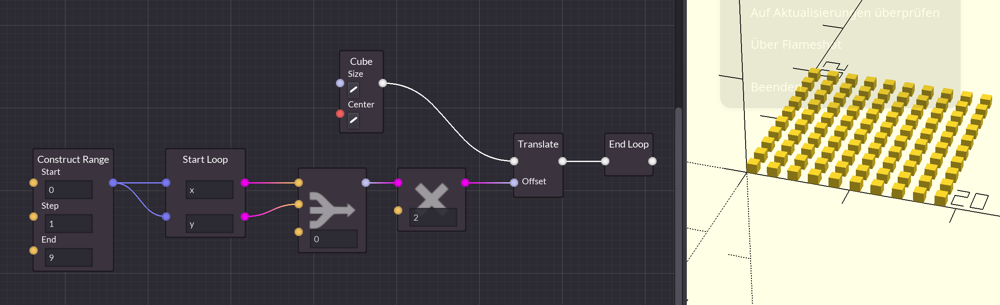
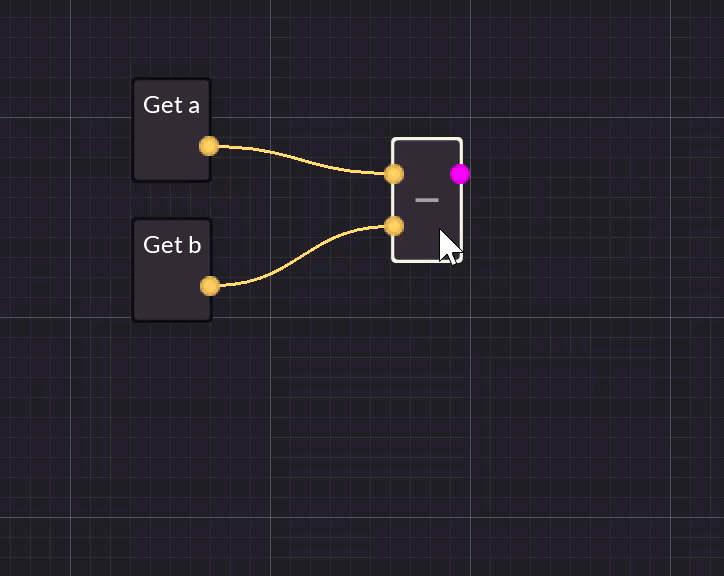
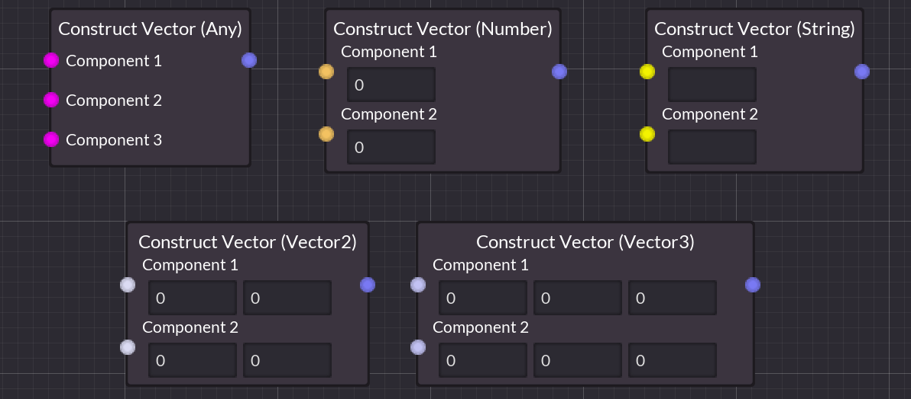
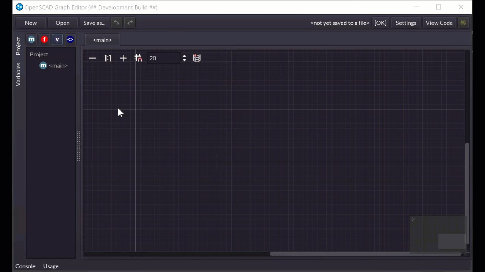
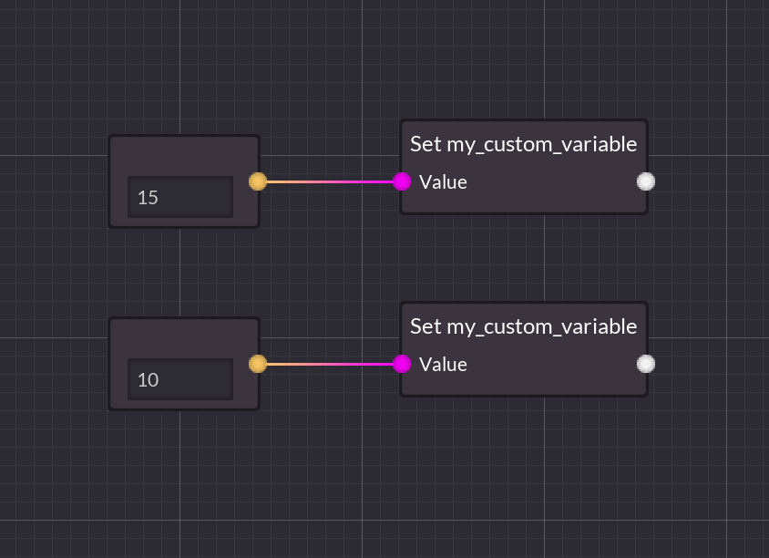
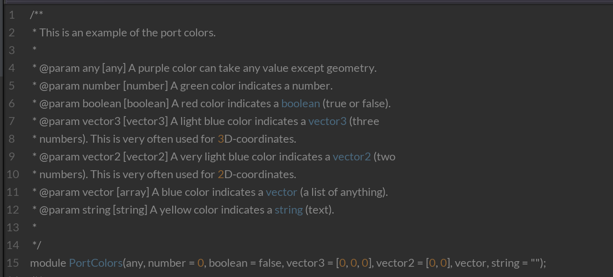
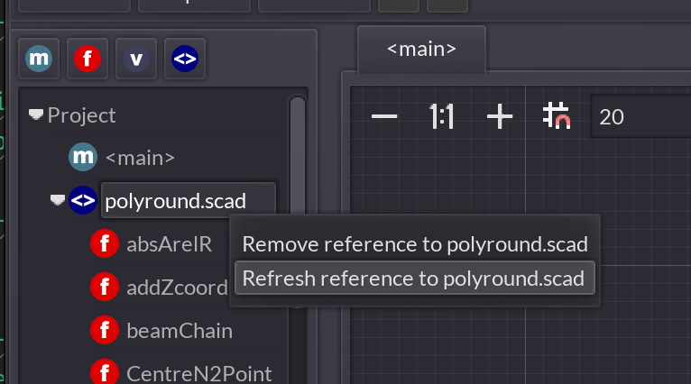

# OpenSCAD Graph Editor Manual

## Table of Contents
<!-- TOC start -->
- [Introduction](#introduction)
- [Installation & Setup](#installation--setup)
  * [Prerequisites for live preview](#prerequisites-for-live-preview)
- [The basics](#the-basics)
  * [Starting a new project](#starting-a-new-project)
  * [Opening an existing project](#opening-an-existing-project)
    + [Project backups](#project-backups)
  * [Nodes](#nodes)
  * [Adding nodes](#adding-nodes)
  * [Getting help for a node](#getting-help-for-a-node)
  * [Selecting nodes](#selecting-nodes)
  * [Connecting nodes](#connecting-nodes)
    + [Port types](#port-types)
    + [Connecting geometry ports](#connecting-geometry-ports)
    + [Unconnected geometry output ports](#unconnected-geometry-output-ports)
    + [Literals for unconnected input ports](#literals-for-unconnected-input-ports)
- [Overview of built-in nodes](#overview-of-built-in-nodes)
  * [Flow control nodes](#flow-control-nodes)
    + [Branch (if/else)](#branch-ifelse)
    + [For-Loop](#for-loop)
      - [Nested loops](#nested-loops)
    + [Intersection loops](#intersection-loops)
  * [Operator nodes](#operator-nodes)
  * [Vector nodes](#vector-nodes)
    + [Construct `vector2` / `vector3`](#construct-vector2--vector3)
    + [Split `vector2` / `vector3`](#split-vector2--vector3)
    + [Construct vector `any`/`number`/`string`/`boolean`/`vector2`/`vector3`](#construct-vector-anynumberstringbooleanvector2vector3)
    + [Index `vector` / `string`](#index-vector--string)
  * [Miscellaneous nodes](#miscellaneous-nodes)
    + [Cast](#cast)
  * [Utility nodes](#utility-nodes)
    + [Double](#double)
    + [Half](#half)
    + [PlusOne](#plusone)
    + [MinusOne](#minusone)
    + [Pairwise vector multiplication `vector2` / `vector3` / `vector`](#pairwise-vector-multiplication-vector2--vector3--vector)
- [Keeping the graph neat and tidy](#keeping-the-graph-neat-and-tidy)
  * [Comments](#comments)
  * [Reroute nodes](#reroute-nodes)
    + [Wireless reroute nodes](#wireless-reroute-nodes)
  * [Straighten connections](#straighten-connections)
  * [Align nodes](#align-nodes)
- [Debugging aids](#debugging-aids)
  * [Changing the color of the output](#changing-the-color-of-the-output)
  * [Debug modifiers](#debug-modifiers)
    + [Debug subtree](#debug-subtree)
    + [Background subtree](#background-subtree)
    + [Disable subtree](#disable-subtree)
    + [Make root modifiers](#make-root-modifiers)
  * [Inspecting expressions](#inspecting-expressions)
  * [Inspecting the generated code](#inspecting-the-generated-code)
- [Reusable code with variables, functions and modules](#reusable-code-with-variables-functions-and-modules)
  * [Variables](#variables)
    + [Creating a new variable](#creating-a-new-variable)
    + [Using a variable](#using-a-variable)
    + [Duplicating a variable](#duplicating-a-variable)
    + [The _Variables_ panel](#the-_variables_-panel)
    + [Things to keep in mind when using variables](#things-to-keep-in-mind-when-using-variables)
  * [Modules](#modules)
    + [Creating a new module](#creating-a-new-module)
    + [Using a module](#using-a-module)
    + [Default values for module parameters](#default-values-for-module-parameters)
    + [Building operator modules](#building-operator-modules)
    + [Changing the module's name and parameters](#changing-the-modules-name-and-parameters)
    + [Finding usages of modules](#finding-usages-of-modules)
    + [Adding documentation to modules](#adding-documentation-to-modules)
    + [Duplicating a module](#duplicating-a-module)
  * [Functions](#functions)
    + [Making a function return a value](#making-a-function-return-a-value)
- [Using functions and modules from text-based libraries](#using-functions-and-modules-from-text-based-libraries)
  * [Adding a reference to a library](#adding-a-reference-to-a-library)
  * [Using functions and modules from the library](#using-functions-and-modules-from-the-library)
  * [Refreshing external libraries](#refreshing-external-libraries)
- [Miscellaneous features](#miscellaneous-features)
  * [Preamble for the generated OpenSCAD code](#preamble-for-the-generated-openscad-code)
- [Reference](#reference)
  * [Keyboard shortcuts](#keyboard-shortcuts)
  * [Documentation comment format](#documentation-comment-format)
    + [An example](#an-example)
    + [Supported data types](#supported-data-types)
    + [Parsing Rules](#parsing-rules)
      - [For parameters](#for-parameters)
      - [For return values](#for-return-values)
<!-- TOC end -->

## Introduction
OpenSCAD is a 3D CAD program that can be used to create 3D models through scripting. The OpenSCAD Graph Editor is a graphical user interface for OpenSCAD that allows you to create 3D models by connecting nodes in a graph. The editor will automatically generate OpenSCAD code for you.

## Installation & Setup

You can download the latest release of the OpenSCAD Graph Editor from [GitHub](https://github.com/derkork/openscad-graph-editor/releases). There is a ZIP file for each supported operating system (e.g. `Windows.zip`, `MacOSX.zip`, `Linux.zip`) on each release. Pick the zip file for your operating system and extract it to a convenient location and run the program. No installation procedure is required. Note if you are on MacOSX you may get a warning that the program is damaged. This is because the application is not notarized with Apple. See [this FAQ entry](https://github.com/derkork/openscad-graph-editor/blob/master/manual/faq.md#i-cannot-open-the-app-on-the-mac-it-says-it-is-damaged) for instructions on how to fix this.

### Prerequisites for live preview
If you want to have a live preview while you are editing, you will also need to download and install [OpenSCAD](https://openscad.org/downloads.html). Then arrange the windows of OpenSCAD Graph Editor and OpenSCAD so that they are next to each other (or place them on different monitors if you happen to have a multi-monitor setup). It is recommended that you hide the editor in the OpenSCAD window (_Window_ -> _Hide Editor_).

After this, you can set up the location of OpenSCAD in the settings menu:


1. Press the _Settings_ button.
2. In the _Settings_ dialog, press the _Select_ button. A file dialog will appear. Select the OpenSCAD executable. Where this is located depends on how you installed OpenSCAD and which operating system you are using.
3. Press the _Open_ button to select the OpenSCAD executable.
4. Press the _OK_ button to close the settings dialog and save the settings.

You are now ready to use the OpenSCAD Graph Editor.

## The basics
### Starting a new project
When you start the OpenSCAD Graph Editor, it will show a blank graph. You can already add nodes to the graph but live preview is not enabled until you actually save the project somewhere. This is because live preview requires that OpenSCAD code is generated and written to a file so that the OpenSCAD executable can read it and produce a live preview. So you should immediately save the project somewhere. You can save it by pressing the _Save as..._ button.  After the project is saved you can start the live preview by pressing the  icon in the top right corner of the editor, provided that you have set it up correctly. If you haven't set this up yet, check the previous section.


From now on you will no longer need to manually save the project. The editor will automatically save the project when you change something in the graph. This will also trigger a refresh in the live preview.

### Opening an existing project
To open an existing project, press the _Open_ button. A popup menu will appear where you can either select a project that you have recently opened or select the _Open file_ option to open a project from a file.


#### Project backups
Whenever you open a project, the editor will automatically create a backup of the project. This backup is stored in the same directory as the project file. The backup file will have the same name as the project file but with the extension `.1`, `.2`, `.3` etc. appended to it. The backup file with the highest number is the oldest backup. The editor will automatically delete old backups when it creates a new backup. The number of backups that are kept is configurable in the settings menu.


You can set this to 0 to disable backups.  If you want to restore a backup, delete the project file and rename the backup file to the original project file name (e.g. remove the `.1`, `.2`, `.3` etc. extension). The backup functionality is mainly intended to prevent data loss in case of a crash or a bug corrupting your file. If you want to keep multiple versions of your project, you will want to use a version control system like [Git](https://git-scm.com/).

### Nodes
The editor is a graph editor. It allows you to create 3D models by connecting nodes in a graph. Nodes are connected through ports (these are the colored circles left and right of the node). A node can have input ports - the ones on the left - and output ports - the ones on the right. This, for example is a _Cube_ node:


It has two input ports which allow you to configure the size and position of the cube and it has one output port where the node will output the resulting geometry. You may notice that the ports have different colors. These colors indicate what kind of data the port can accept (for input ports) and what kind of data the port will output (for output ports).


The following colors are used:

- _Purple_ - any value except geometry
- _Green_ - a number
- _Red_ - a boolean value (true or false)
- _Very Light Blue_ - a vector2 (a combination of 2 numbers), used for 2D coordinates
- _Light Blue_ - a vector3 (a combination of 3 numbers), used for 3D coordinates
- _Blue_ - a vector (a list of arbitrary length with arbitrary contents)
- _Yellow_ - a string (a text value)
- _White_ - geometry (a 2D or 3D object)

### Adding nodes
There are multiple ways to add nodes to the graph. You can right-click on a free space in the graph or press the   icon in the toolbar to open the _Add Node_ dialog.  This contains a list of all available nodes. You can then type the name of the node you want to add and press `Enter` or double-click the node in the list to add it to the graph. All built-in nodes come with a unique short name which is indicated in square brackets behind the node's full name. For example the _Cube_ node has the short name _Cbe_. This feature allows you to quickly add nodes by typing their short name and pressing `Enter`.


If you already have a node in your graph, you can also drag from one of its ports (input or output) to a free space in the graph. This will also open the _Add Node_ dialog. In addition it will filter the selection of nodes to only show the ones that can be connected to the port you dragged from. If for some reason you don't want the list filtered, you can uncheck the _Filter by current context_ checkbox in the _Add Node_ dialog.


After you have selected a node from the list the node will be added to the graph and will automatically be connected to the port you dragged from.


### Getting help for a node

Sometimes it may not be immediately obvious what a node does and what needs to be connected to its inputs and outputs. You can get help for any node by selecting it and then pressing the `F1` key on your keyboard. This will show a help screen for that node which describes what the node does.


### Selecting nodes

You can select a node by clicking on it. You can select multiple nodes by holding down the `Ctrl` / `Cmd` key while clicking on nodes. This also allows you to de-select single nodes while keeping the other nodes selected.


You can also select multiple nodes by dragging a selection rectangle around them. You can hold down the `Ctrl` / `Cmd` key while dragging to add to the selection. 


If you press `Shift` while dragging a selection, the selected nodes will be removed from the selection.


To select all nodes in the graph, press `Ctrl` + `A` / `Cmd` + `A`. To deselect all nodes, left-click on a free space in the graph.


### Connecting nodes

You can connect nodes by dragging one of the output ports of a node to an input port of another node or vice versa. Every connection must be made between an input port and an output port. The connections indicate how data flows between nodes. **Data always flows from left to right.** This is true for all port types (including geometry). Let's explore this in a few examples:


Here you have two nodes representing the numbers 7 and 4. Their output goes into the two input ports of an addition node (`+`). This node will output the sum of the two numbers from its input ports. Then its output is connected to one input port of a multiplication node (`*`). This node will output the product of the two numbers from its input ports. You can see that nothing is connected to the second input port of the multiplication node. When you connect nothing to a node's input port, depending on the type of the port you can enter values directly. In this case `2`  was entered, so the multiplication node will now multiply the result from the addition node by 2. You can hover over nodes to see what the node will produce. In this example the whole chain of nodes will produce the expression `((7 + 4) * 2)`.

Lets check another example which involves geometry:


Here we have two nodes which create cube(oid)s. The first creates a cube with a size of 2x2x2 units. The second node creates a cuboid with a size of 1x3x1 units. We then add a _Difference_  node which subtracts the second cube from the first. As a result we get a 2x2x2 cube with a hole in the middle. In the example screenshot the second cube has been given a debug modifier so you can see it in translucent red in the 3D view. Without this modifier it would not be visible. Again you can see that **data always flows from left to right**. The two cubes on the left are the input for the _Difference_ node on the right and the _Difference_ node's output will contain new data produced from its inputs.

#### Port types

In general you can only connect ports which have the same port type (e.g. the same color), e.g. it just doesn't make sense to connect a boolean value to a port expecting geometry. There are some exceptions to this rule though:

- A port type of `any` (purple) can be connected to any other port type except `geometry` (white) and vice versa.
- A port type of `vector3` (light blue) can be connected to a port type of `vector` (blue) but not the other way around.
- A port type of `vector2` (very light blue) can be connected to a port type of `vector` (blue) but not the other way around.

Every input port (except geometry, see the next section for details) can only accept a single connection. It is also not allowed to connect nodes in a way that would form a loop.

#### Connecting geometry ports

Geometry (white) ports are somewhat different from the other ports. They follow a concept called _implicit union_. This means that when you connect two geometry output ports into a single geometry input port, the resulting geometry will be the union of the two input geometries.


We first have a 2x2x2 cube and a sphere with 1.2 units radius. Both of them are connected to the _Add_ port of the _Difference_ node. Then we have two cuboids forming a cross-like shape. Both of these are connected to the _Subtract_ port of the _Difference_ node. What will happen now is that the _union_ of everything connected to the _Subtract_ port will be subtracted from the _union_ of everything connected to the _Add_ port. So we get a cube with some parts of the sphere on the outside with two holes made by the two cuboids. Again for visualization purposes a debug modifier was added to the cuboid nodes, so you can see them in translucent red in the 3D view.

The _implicit_ union behaviour simplifies the node graphs as you don't need to add extra nodes when you want to build the union of some geometry.

#### Unconnected geometry output ports

You may have noticed that in the previous examples the geometry output of the _Difference_ node is not connected to anything. Yet it still renders in the output. This is another side effect of the _implicit union_ behaviour. All geometry ports which are not connected to anything else will be implicitly added to the output geometry. So let's check another example:


Here we have two spheres with a radius of `1`. The first sphere is translated on the x-axis by `-2`, the second sphere is translated on the x-axis by `2`. Both _Translate_ nodes are not connected to anything else. So the _implicit union_ behaviour will add the two translated spheres to the output geometry and this is what you can see in the result.

#### Literals for unconnected input ports

When you connect something to an input port the port will use the value that was connected to it. If you don't connect something to an input port, most ports (all except _geometry_, _vector_ and _any_) will allow you to specify the value directly in the node without having to create an extra node and connecting it to the port. This can help keep your node graphs smaller and simpler. Lets see this in action:


Here we have two cube nodes and a translate node. All nodes have nothing connected to their inputs, so their input ports now allow you to specify the value directly. You may notice that the cube node in the top left has two little buttons next to each of its input ports. These buttons are displayed when an input port has a default value. Cube's have a default size of `[1,1,1]` and are not centered by default. When the button is not pressed, the built-in default value for that port will be used. If you press the button, you can override the default value with a custom value. This can be seen in the top right cube node where both the _Size_ and the _Center_ value are overridden.

Some input ports may not have a default value and are therefore required. This is the case for the _Translate_ node. It does not have a default value for the translation _Offset_ so the little button is not displayed. You can still specify the value directly in the node or connect another node to the input.


## Overview of built-in nodes

OpenSCAD graph editor contains nodes for all [functions and modules](https://openscad.org/cheatsheet/) built into OpenSCAD. So if you look for a certain function you can just type its name into the _Add node_ dialog.

There are some nodes which are not directly representing a function in OpenSCAD but are used to achieve the same effects as a built-in language construct in the original OpenSCAD language. These will be described in the following sections.

### Flow control nodes

#### Branch (if/else)

The branch node allows you to render geometry depending on a condition. The condition is specified by a boolean expression.


The node will output the geometry connected to the _true_ port if the condition is `true`, and the geometry connected to the _false_ port if the condition is `false`. In the example it would output the geometry of the sphere as the condition is not connected and set to `false`.

#### For-Loop

The for-loop node allows you to repeatedly create geometry with different inputs. It actually consists of two nodes: _Start loop_ and _End loop_ but you will only need to add a _For loop_ node and the _Loop end_ node will be added automatically. Whenever you select either of the two nodes belonging to a loop, the editor will automatically highlight the other so you can keep track of which _Start loop_ and _End loop_ nodes belong together.

Consider the following example of a for-loop:


This will create a circle of spheres offset by 30 degrees from each other. The _Start loop_ node has an input port for any vector-like construct (e.g. a `vector2`, `vector3` or `vector`). The loop will be repeated for each item in the given vector. In this example we use the _Construct Range_ node to build a vector that has the numbers `0` to `360` in it with steps of `30`.

We can give the loop variable a name (though it is not needed, if you don't give a name then OpenSCAD graph editor will internally generate a unique variable name for you). Now inside the loop we build a sphere, offset it by 10 units on the x-axis and rotate it by the current angle. The result of this will connect to the _End loop_ node. This will generate 12 spheres and because of the _implicit union_ behaviour they will be added to the output geometry one by one. The result is a circle of spheres.

##### Nested loops

You can nest loops inside of each other by creating multiple _For loop_ nodes. However this quickly can clutter your node graph. Instead, you can right-click on a _Start loop_ node and select the _Add loop nest level_ option:


This will add a second input to the _Loop start_ node and the loop will now repeat for each combination of values in the two input vectors. Consider the following example. We start with a loop that renders ten cubes in a row. To do this we use a _Construct Range_ node to build a vector that has the numbers `0` to `9` in it. We use that as input for the loop and then calculate a translation vector that moves the cube 0, 2, 4, 6, ... units along the `x`-axis in each iteration:


Now say we want to have a square made out of cubes, so we need to translate the cube both in the `x` and `y` directions. For this we can simply add a loop level and connect the range output to the second input of the loop. Now the loop will run once for each combination of `x` and `y`. We use the values of `x` and `y` to calculate the translation vector.



We can take this one step further and add a third loop level. Now the loop will run once for each combination of `x`, `y` and `z`. We use the values of `x`, `y` and `z` to calculate the translation vector. This yields us a cube made out of cubes:


#### Intersection loops

A _For loop_ by default returns the union of all iterations. Sometimes you want to return the intersection of all iterations. To do this, right-click the _Loop start_ node and select the _Toggle intersection mode_ option. This will will switch the _For loop_ to an _Intersection-for loop_.


In the example we have three spheres which are created by a _For loop_. You can see the three spheres in the output geometry. Now we switch the _For loop_ to an _Intersection-for loop_ and we get only the intersection of all spheres.

### Operator nodes

Operator nodes are used to calculate values from other values. A simple example is the _Add_ node which adds two values together:


Operator nodes have some useful functionality built into their right-click menu. For example, you can right-click on the _Add_ node and select the _Change operator_ option to change the operator to something else while keeping all the connections intact. This is useful if you want to change to a different operator without having to create a new operator node and reconnecting all the inputs.


You can also right-click on an operator node and select the _Flip inputs_ option. This will quickly swap the inputs of the node. This is useful if you want to change the operands without having to reconnect them manually.

Operator nodes will automatically switch their input and output port types to match what is connected to them. For example if you connect a `vector3` and a `number` to the inputs of a _Multiply_ node, then the output port will be of type `vector3`, while if you connect two `vector3` to the inputs of a _Multiply_ node, then the output port will be of type `number`.



For calculating boolean values there are also boolean operators available. These are the _And_ (&&), _Or_ (||) and _Not_ (!) nodes. They work similar to the other operator nodes, but they only accept boolean values as input and they will output a boolean value.


### Vector nodes

Vectors play a large role in OpenSCAD. They are used to represent positions and directions and are also a generic way of grouping data. The following nodes are used to create and manipulate vectors:

#### Construct `vector2` / `vector3`

These nodes allow you to build a `vector2` or `vector3` from numbers.


You can either give the values directly or connect other nodes to the input ports.

#### Split `vector2` / `vector3`

These nodes do the opposite of _Construct `vector2`/`vector3`_ - they allow you to extract the values of a `vector2` or `vector3`:


You connect a `vector2` or `vector3` to the input port and the output port will contain the values of the vector.

#### Construct vector `any`/`number`/`string`/`boolean`/`vector2`/`vector3`

These nodes allow you to construct a vector of arbitrary length that contains values of different types.



These nodes are useful if for example you want to create a list of points as input for the _Polygon_ or _Polyhedron_ nodes. You can add new items to the vector by right-clicking it and selecting _Add item_.


Similarly you can remove the last item from the vector by right-clicking the node and selecting _Remove item_.


#### Index `vector` / `string`

This node allows you to extract a value from a `vector` or `string` value.


In this example we have a `vector` with three values (`7`, `6`, `2`). The node is configured to extract the value at index 1. So the output port will contain `6` (indices are zero-based, so an index of `0` will return the first value, `1` will return the second value and so on). For strings this will return the character at the given index.

### Miscellaneous nodes
#### Cast

Sometimes a node needs an input value that doesn't match the type of the output value. For example you may want to construct a range which has 3 items in it and technically is a `vector`. But in this case you are sure it is actually a `vector3`. The editor has no way of knowing this without actually running the program, so it will not let you connect the output of _Construct range_ to anything that takes a `vector3`. You can use the _Cast_ node to work around this. The _Cast_ node has an input and output port of type `any` so it can be connected to anything (except geometry).


The _Cast_ node will not magically convert a node to a different type. It is simply a way of telling the editor: _"I know what I am doing, trust me that this is the correct type."_ If you connect ports that actually do not match the OpenSCAD compiler will show you an error when you try to run the program.


### Utility nodes

The following nodes have been added to simplify often-used operations. They can all be replicated with one or more other nodes but are included for convenience as they require less nodes to achieve the same result or reduce visual clutter.

#### Double

 This node calculates the double of the given input number or vector. It is equivalent to using the multiply node with a factor of 2.


#### Half

This node calculates the half of the given input number. It is equivalent to using the divide node with a divisor of 2.


#### PlusOne

This node calculates the given input number plus one. It is equivalent to using the add node with an addend of 1.


#### MinusOne

This node calculates the given input number minus one. It is equivalent to using the subtract node with a subtrahend of 1.


#### Pairwise vector multiplication `vector2` / `vector3` / `vector`

This node takes two `vector2`, `vector3` or `vector` values. It multiplies the values of the given vectors pairwise and returns a new `vector2`, `vector3` or `vector` with the result.


This functionality is not actually built into OpenSCAD (e.g. using the normal multiplication operator `*` will return the dot product of the vectors). Under the hood this will build a loop that walks over the vectors and multiplies the values pairwise.


#### Sum

The _Sum_ node is a specialization of the _Add_ operator. It allows you to sum any number of inputs. Since summing up values is a very common operation this node is included for convenience and better graph readability. The following two setups are equivalent:


The _Sum_ node can sum numbers or vectors (e.g `vector2`, `vector2`, `vector`), but you cannot mix numbers with vectors as the result would be undefined. Like the operator nodes the sum node will automatically adjust its output type to match the sum produced by the input types.

## Keeping the graph neat and tidy

When you add and connect a lot of nodes it is easy to quickly get into a big ball of spaghetti which is not very readable. You want to keep your graph as tidy as possible, so you can look at it some time later and still know what you were doing. OpenSCAD graph editor has some features to help you keep your graph clean.

### Comments

You can add a comment to any node by right-clicking it and selecting _Add comment_ or by selecting a node and pressing the `F2` key. This allows you to add a short comment which will appear on top of the node.


### Reroute nodes

When you have quite a few nodes connected to each other it can become difficult to avoid having connections crossing over other connections and thereby making the graph look messy. The _Reroute_ node allows you to reroute a connection, so you can prevent connections from crossing over each other. You can create a reroute node either by using the _Add node_ dialog or by holding `Shift` while you drag a connection to an empty space.

#### Wireless reroute nodes

Sometimes even with reroute nodes a graph will become too messy because there are just so many connections and there is no really good way of routing them so they don't create spaghetti. For this case you can use a _Wireless reroute_ node. This works the same way as a normal reroute node but it only shows its connection to the input port when it is selected. This can be very useful in de-cluttering dense graphs. You should however use the wireless nodes sparingly as they keep you from understanding your node graph at a glance.

To create a _Wireless reroute_ node you can either right-click an existing reroute node and select _Make wireless_ in the popup menu or you can hold `Ctrl+Shift` while dragging a connection to an empty spot.

You can also turn a _Wireless reroute_ node back into a normal _Reroute node_ by right-clicking it and selecting _Make wired_ in the popup menu.

The following image shows how you can clean up a cluttered node graph with reroute nodes:


When you delete a reroute node all connections that were routed through it will be deleted as well. If you want to keep the connections you can hold `Shift` while deleting the reroute node. This will delete the reroute node but keep the connections.


### Straighten connections

You can straighten the connections between nodes by selecting a the nodes between which you want to straighten the connections and then pressing the `Q` key.

Connections will be straightened from right to left, e.g. the right-most node will never be moved. The algorithm will work from the right-most node and then move nodes left of the right-most node up and down so that the first connection between them is straight.


### Align nodes

You can align nodes by selecting at least two of them and then press the `W`, `A`, `S` or `D` key to align their top, left, bottom or right edges.


## Debugging aids

Sometimes it is not immediately obvious why something is not working as expected. OpenSCAD has some debugging aids built-in which help you see what is going on.

### Changing the color of the output

A very simple way to see what is going on is simply adding a bit of color to a node so you can see which node produces which output. You can color the output of a node by right-clicking it and selecting _Set color_.


In this example we give the sphere a purple color and the cube a blue color. Naturally this will only work for nodes that produce geometry output.

### Debug modifiers

OpenSCAD provides several modifiers which change the way a sub-tree is rendered. You can quickly toggle these modifiers for any node outputting geometry through the node's context menu.


#### Debug subtree

The _Debug subtree_ modifier will render the node's output in a translucent red color. This is for example useful in debugging a  _Difference_ node as it allows you to see the geometry that is being subtracted.


In this example where two cylinders are subtracted from a cube, one cylinder has a debug modifier applied. You can see this by the little  icon above the node. Now the cylinder is rendered in a translucent red color.

#### Background subtree

The _Background subtree_ works similar to the _Debug subtree_ modifier but it will render the node's output in a translucent grey color. Also the output of the node will not be used for any subsequent operations in the graph.


This is the same example as above but with the background modifier applied. You can see the cylinder is rendered in a translucent grey color and is no longer subtracted from the cube.


#### Disable subtree

The _Disable subtree_ modifier will disable the node's output. This is useful if you want to temporarily disable a node.


The second cylinder is now disabled. Its node is being displayed slightly translucent in the graph editor to indicate this. The cylinder no longer appears in the live preview.

#### Make root modifiers

The _Make root modifiers_ modifier is essentially the opposite of the _Disable subtree_ modifier. It will disable all other nodes and only render the node with which has the modifier applied.


Now only the cylinder is rendered, everything else is disabled. Only one node can have this modifier at a time. If you add the modifier to another node, it will remove the modifier from the node which previously had it.


### Inspecting expressions

When you build expressions in the graph, sometimes the resulting graph can be a bit overwhelming and it would be nice to be able to see the expression in a more conventional format. That is why OpenSCAD graph editor allows you to see the built expression by simply hovering over any node that produces an expression:


### Inspecting the generated code

If you want to inspect the generated OpenSCAD code you can press the _View Code_ button in the top right of the editor. This will replace the node graph with a text editor which shows the generated code.


## Reusable code with variables, functions and modules
### Variables
Variables allow you to parameterize your graph. Instead of making an object that has fixed dimensions, you can create variables which allow you to change the dimensions of your object without having to change the graph. They can also be used to toggle certain features of your object on and off. This is very useful if you want different variations of the same object. If you upload your OpenSCAD files on sites like Thingiverse, users can then easily change the dimensions and features of your object to fit their needs.

#### Creating a new variable
To create a variable, click the  icon above the project tree. This will open the _Variables_ dialog.



Variables need a name. You should also give your new variable a type, so you (and the editor) know what kind of value you can to assign to it. You can also give your variable a default value. This is the value the variable will have by default, unless you change it later with a _Set variable_ node. Finally, you can decide whether the variable should appear in OpenSCAD's [customizer panel](https://en.wikibooks.org/wiki/OpenSCAD_User_Manual/Customizer). This allows users to quickly change the value of a variable without changing the OpenSCAD code. Depending on the type of variable you create, the customizer panel will show a slider, a checkbox, a vector edit or a text field. You can also add constraints to your variable. This will make sure that the value of the variable is always within the specified range. Which constraints are available, depends on the type of variable you create.

Now the variable will be visible in your project tree.

#### Using a variable

To use a variable, you can simply drag it into the graph from your project tree. This will offer you two options:

- Get `name of the variable` - will create a node that provides the value of the variable which you can then connect to another node.
- Set `name of the variable` - will create a node that allows you to set the value of the variable.

The next image shows you how to set a variable's value to 10 and then use an `echo` node to print the value of the variable:


#### Duplicating a variable

If you want to create a new variable with the same name, type, default value and customizer settings as an existing variable, you can right-click the variable in the project tree and select _Duplicate variable_. This will create a new variable with the same name as the original variable, but with a number appended to the name. This number will be incremented until the name is unique. This is much faster than creating a new variable and then manually copying all the settings.


#### The _Variables_ panel

On the left side of the editor, you can see the _Variables_ panel. This panel shows you all the variables in your project. You can also use this panel to change the default value of a variable. The variables panel works similar to OpenSCAD's [customizer panel](https://en.wikibooks.org/wiki/OpenSCAD_User_Manual/Customizer), however it can also be used to change the default value of variables which are not shown in the customizer panel. Changes in the variables panel will be immediately reflected in the generated OpenSCAD code, so you can use it to quickly test your variables.


You can click on a variable name to edit the variable. You can change the name, type, default value and constraints. You can also change whether and how the variable should appear in the customizer panel. All usage points of the variable will be updated to reflect the changes you made.


If you want to delete a variable, you can right-click it in the project tree and select _Delete variable_.


#### Things to keep in mind when using variables

Variables in OpenSCAD are useful, but they have a few peculiarities that are different from how variables work in other programming languages. Especially when setting variables, it is important to understand how they work. OpenSCAD Graph Editor will generate code that orders the nodes by their position in the graph. Nodes will be sorted top to bottom and left to right. For example consider these two nodes that set a variable:


This will produce the following OpenScad code:

```openscad
my_custom_variable = 10;
my_custom_variable = 15;
```

If you rearrange the nodes, the order in which the variables are set will change:



Here the assignment of the value `15` is above the assignment of the value `10`, so the generated code will be:

```openscad
my_custom_variable = 15;
my_custom_variable = 10;
```
There is however a big pitfall here. OpenSCAD will run variable assignments [before any other code - at compile time](https://en.wikibooks.org/wiki/OpenSCAD_User_Manual/General#Variables_are_set_at_compile-time,_not_run-time). This means that if you assign a value to the same variable multiple times, the last assignment will win no matter what. This can have some unintuitive side effects. Consider this graph:


It sets the value of `my_custom_variable` to `10`, then prints `my_custom_variable` and then sets the value of `my_custom_variable` to `15`. The generated code will be:

```openscad
my_custom_variable = 15;
echo(my_custom_variable);
my_custom_variable = 10;
```
However, when you execute this, the printed value will actually be `10`, because `10` was the last value assigned to `my_custom_variable`. It is therefore a good idea to only use variables to parameterize your graph, but not to store any intermediate values.

Because OpenSCAD Graph Editor is a visual editor, there is a lot less need for having intermediate values stored in a variable. You can simply connect the output of a calculation into multiple inputs without the need to create a variable for this:


Another option is to put more complex calculations into a [function](#functions) and use that function.
You can also make use of [wireless reroute nodes](#wireless-reroute-nodes) to keep your graph neat and tidy.

### Modules
#### Creating a new module
OpenSCAD allows you to build custom modules, so you can reuse code. In OpenSCAD graph editor you can also create custom modules. To create a new module, click the  icon above the project tree.


A popup dialog will open. In this dialog you can specify the name of the module and any parameters and their types.  Once you are done press _OK_ to create the module. A new tab will open in which you can edit the graph of the module. It will already contain one node - the module's entry point - from which you can drag out the parameters given to your module.

Editing a module graph works exactly the same as editing the main graph (the main graph is also a module in a sense). Also the rules about _implicit union_ behaviour apply, so every node that has an unconnected _geometry_ port will be implicitly added to the output geometry of the module.

#### Using a module

To use a module in your main graph (or another module) you can either add it through the _Add Node_ dialog by just typing the module's name or you can drag it from the project tree into the graph like this:


#### Default values for module parameters

Module parameters can be given default values. To specify a default value for a module parameter click the  icon next to the parameter's name in the module's entry point. This will then add a literal field to this parameter where you can enter the default value:


#### Building operator modules

OpenSCAD allows you to build so-called operator modules. These are modules which modify input geometry. You can make any module an operator module by adding the _Child_ or _Children_ nodes. These nodes allow you to access the input geometry of the module. For example if you want to make a module that moves everything by 20 units on the x-axis, you could build it like this:


If you now use the module in another graph, you will notice that it has gotten an additional geometry input. This is where you will connect geometry that should be modified by the operator module:


#### Changing the module's name and parameters

It is possible to rename a module and add, reorder, rename and delete parameters. To do so, right-click either the module's entry point or any instance where you use the module. A popup menu will open. Select the _Refactor &lt;module&gt;_ entry.


Now the refactoring dialog will open and you can change the module's name, the name, and the type of any of its parameters. You can also reorder parameters by pressing the up and down buttons next to each parameter. You can also delete parameters. Once you are done, press _OK_ to apply the changes.


This will automatically update the module's entry point and all places where the module is used. The following rules will apply:

- All name changes will be reflected in the node view and the generated code.
- If you reorder parameters, connections will be preserved and reordered accordingly.
- If you rename a parameter, this has no effect on the connections to this parameter, e.g. all connections to the parameter will remain as they were.
- If you delete a parameter, all connections to that parameter will be deleted.
- If you add a parameter, it will be available as new port for the module's node but no connections will be created for it.
- If you change parameter types, the connections to the parameter will be preserved as long as the types are compatible. If the types are no longer compatible, connections to that parameter's port will be deleted.

#### Finding usages of modules

After you have refactored a module, you may want to check places where this module is used, e.g. to add new connections to an added parameter. To find all places where a module is used, right-click the module's entry point or any instance where you use the module. A popup menu will open. Select the _Find usages of &lt;module&gt;_ entry. A tool window will open with a list of all places where the module is used. You can double-click any entry in this list and the corresponding node will be shown on screen and briefly highlighted.


#### Adding documentation to modules

You can add documentation to your modules, so you and other users can understand what the module does. To add documentation to a module, right-click either the module's entry point or any instance where you use the module. A popup menu will open. Select the _Edit documentation of &lt;module&gt;_ entry:


Now a dialog will open where you can add descriptions to the module and the parameters.


When you are done, press _OK_ to save the documentation. The documentation will now be shown if you request help for the module (by pressing `F1` or the  icon in the toolbar).


It will also be rendered out in the generated OpenSCAD code.



#### Duplicating a module

Sometimes you may want to duplicate a module to serve as a starting point for a new module. To do so, right-click either the module's entry point or any instance where you use the module or right-click the module in the project tree. A popup menu will open. Select the _Duplicate &lt;module&gt;_ entry. This will copy the whole module including its documentation, parameters and node graph. The new module will have the same name as the old one with a number appended to it. You can then rename the module and change its parameters as you see fit.


If the module calls itself recursively, the recursive call will be replaced with a call to the new module, so that the functionality of the module is preserved.

### Functions

Functions work very much like modules, except that they have a return value and they cannot create or work with geometry. You can add a new function by pressing the  icon above the project tree. A popup dialog will open. In this dialog you can specify the name of the function, its return type and any parameters and their types. Once you are done press _OK_ to create the function. A new tab will open in which you can edit the graph of the function. It will already contain two nodes:

- the function's entry point, from which you can drag out the parameters given to your function
- the function's return value node which has an input port for the function's return value


#### Making a function return a value

Functions have an additional node where you can connect the return value of the function. For example, let's see a function that simply adds two numbers:


The two numbers are given as parameters to the function. Then we use an _Add_ node to add the two numbers. The output of the _Add_ node is connected to the _Return_ node's input port, so now the function will return the sum of the two numbers.

From here on functions work exactly the same as modules. So you can use them the same way by dragging them from the project tree into the graph, change, move or delete parameters and the return type, duplicate them, find their usages and can edit their documentation in the same way as you do for modules.

## Extracting parts of the graph into modules or functions

When you work on a more complex model you usually want to create smaller reusable modules and functions to keep things neat and tidy. OpenSCAD Graph Editor simplifies this process significantly by allowing you to extract parts of the graph into modules or functions. To do this, simply select a set of nodes and press `Ctrl`+`E` or `Cmd`+`E` on Mac. Alternatively you can also click the   icon in the tool bar.


In this example a set of nodes that  calculates a circumference of a rectangle is extracted into a function. When extracting editor will automatically create functions and modules according to these rules:

- if any geometry node is involved, a module will be created, otherwise a function will be created
- if any connection goes into the selected nodes from a non-selected node, a parameter will be created for the function/module
- likewise if any connection goes out of the selected nodes to a non-selected node, a return value will be created for the function
- if an incoming connection is a geometry connection,  the module will become an [operator module](https://en.wikibooks.org/wiki/OpenSCAD_User_Manual/User-Defined_Functions_and_Modules#Operator_modules) (e.g. modify incoming geometry and return the modified geometry)
- parameter types and return types will be inferred from the connected nodes
- parameter names will also be inferred from the connected nodes, if possible, otherwise they will be named `param1`, `param2`, etc - you can change the names later
- if the node selection cannot be meaningfully extracted into a function or module (e.g. if it has multiple return values), the extraction will fail and a message will be displayed

## Using functions and modules from text-based libraries

OpenSCAD has no shortage of [libraries](https://openscad.org/libraries.html) which simplify a lot of things, from creating standardized parts like nuts and bolts over ready-made enclosures, rounded edges, threads, etc. Therefore OpenSCAD graph editor allows you to include these libraries and use their functions and modules just like you would use any built-in function and module.

### Adding a reference to a library

You can add a reference to a library by clicking the  icon above the project tree. This will open a dialog where you can select the library you want to add:


You can then choose an include mode:

- _Include_: The library will be included in the OpenSCAD code and all code that is in the library file outside of module/function declarations will be executed.
- _Use_ : The library will be included in the OpenSCAD code but all code that is in the library file outside of module/function declarations will **not be executed**.

Next you can choose how you want to refer to the library.

- _Relative_ - the library path will be relative to the current file. This is recommended for most cases as you can transfer the project and its libraries to another computer. This option is only available after you have saved the current file, otherwise there would be no way of calculating a relative path.
- _Absolute_ - the library path will be absolute. This is usually not recommended as the file will then only work on the computer it was created on.
- _Library_ - the library will be resolved from the OpenSCAD library path. This is recommended if you want to use libraries in multiple projects.

Finally you can select the actual library file. If you have selected _Relative_ or _Absolute_ mode, you can use a file picker to pick the library file. If you have selected _Library_ mode, a dropdown will appear showing all OpenSCAD libraries within the OpenSCAD library path.

Once everything is set up, press _OK_ to add the library. OpenSCAD graph editor will now parse the library and show all functions and modules in the tree. For big libraries with lots of functions and modules and possibly lots of recursive includes (like BOSL2) this may take a few seconds, so please be patient.


### Using functions and modules from the library

You can use functions and modules from the library by dragging them from the tree into the graph or through the _Add Node_ dialog, just like any other built-in function or module:


Wherever possible, OpenSCAD graph editor will try to infer the correct type of the parameters from the code. If you want to make sure that the correct parameter types are inferred, you can add documentation comments to the function or module. See the section about the [documentation comment format](#documentation-comment-format) for details.

### Refreshing external libraries

For performance and usability reasons OpenSCAD graph editor does not automatically refresh external libraries when they change. You can refresh a library by right-clicking its entry in the project tree and then selecting the _Refresh <library>_ option:



Refreshing a library will re-parse the library sources and then update any references to changed functions and modules in the graph. The following will happen:

- If you deleted a function, module or variable from the library all its uses will be deleted from all graphs. This will also delete all connections from and to the deleted nodes.
- If you added a function, module or variable to the library it will appear in the tree and in the _Add Node_ dialog.
- If you have changed the parameters of a function or module, all usages will be updated:
  - If a parameter was added, the node will get an additional input port.
  - If a parameter was removed, the node will lose an input port and all connections to that input port will be removed.
  - If a parameter changed position, the input port will be moved to the new position and all connections will be updated.

You may have noticed that there is no functionality for supporting renames. This is simply because a rename operation looks like the combination of a delete and an add operation. There is no reliable way of telling these operations apart. If you would like to rename something it is recommended that you first add a copy of the item with the new name, then use the built-in usage-search to find all places where the old name is used and replace it with the new name. Then you can delete the original item.

## Miscellaneous features
### Preamble for the generated OpenSCAD code
Sometimes you may want to add some code to the head of the generated OpenSCAD code. For example, you may want to add a license header or some preprocessing statements for third party software like RapCAD. You can set up a preamble in the _Settings_ dialog in the _Default Preamble_ setting.


This preamble will be used for new projects.You can also set the preamble for the currently open project in the _Current Project Settings_ tab:


OpenSCAD graph editor will render the code in the preamble verbatim, so make sure that it is valid OpenSCAD code.

## Reference
### Keyboard shortcuts

- `F1` - Open help for the currently selected node.
- `F2` - Change comment for the currently selected node.
- `Q` - straighten connections between the selected nodes.
- `A` - align selected nodes to the left.
- `D` - align selected nodes to the right.
- `W` - align selected nodes to the top.
- `S` - align selected nodes to the bottom.
- `Delete` or `Backspace` - delete selected nodes.
- `Shift` + `Delete` or `Shift` + `Backspace` - delete selected nodes, retaining connections if possible.
- `Ctrl`+`A` / `Cmd`+ `A` - Select all nodes.
- `Ctrl`+`C` / `Cmd`+ `C` - Copy the selected nodes.
- `Ctrl`+`D` / `Cmd`+ `D` - Duplicate the selected nodes.
- `Ctrl`+`Shift`+`D` / `Cmd`+`Shift`+`D` - Duplicate the selected nodes and keep the copies connected to the graph.
- `Ctrl`+`E` / `Cmd`+`E` - Extract the selected nodes into a module or function.
- `Ctrl`+`V` / `Cmd`+`V` - Paste the copied nodes.
- `Ctrl`+`X` / `Cmd`+`X` - Cut the selected nodes.
- `Ctrl`+`Z` / `Cmd`+`Z` - Undo the last action.
- `Ctrl`+`Shift`+`Z` / `Cmd`+`Shift`+`Z` - Redo the last action.
- `Right Click` over a connection - Delete the connection.
- `Shift` + `Right Click` over a connection - Insert a reroute node on the connection.
- `Shift` + `Ctrl` + `Right Click` / `Shift` + `Cmd` + `Right Click` - over a connection - Insert a wireless reroute node on the connection.
- Holding `Shift` while dragging a connection to an empty space - Create a reroute node.
- Holding `Ctrl`+`Shift` while dragging a connection to an empty space - Create a wireless node.
- `Ctrl` + `Shift` + `T` / `Cmd` + `Shift` + `T` - Show stylus debug dialog.

### Documentation comment format
OpenSCAD graph editor uses a standardized format for documentation comments. If you follow this format in text-based OpenSCAD libraries, OpenSCAD graph editor will be able to parse the format and show better documentation for the nodes when pressing `F1`.

#### An example
```openscad

/**
 * Lorem ipsum dolor sit amet, consetetur sadipscing elitr,
 * sed diam nonumy eirmod tempor invidunt ut labore et dolore
 * magna aliquyam.
 * @param a Lorem ipsum dolor sit amet
 * @param b Lorem ipsum dolor sit amet
 * @param c [vector3] Lorem ipsum dolor sit amet
 */
module foo(a = 10, b = [1,2,3], c) { /* ... */ }

/**
 * Lorem ipsum dolor sit amet, consetetur sadipscing elitr,
 * sed diam nonumy eirmod tempor invidunt ut labore et dolore
 * magna aliquyam.
 * @param a [number] Lorem ipsum dolor sit amet
 * @param b ipsum dolor sit amet
 * @return [number] diam nonumy eirmod tempor invidunt
 */
function bar(a, b = "foo") = (/* ... */) ;
```
Parameters for both modules and functions are documented as:

```
@param <name> [<type>] <description>
```

where the type is written in `[]` and is optional. Return values of functions are documented as:

```
@return [<type>] <description>
```

where again the type is written in `[]` and is optional.

#### Supported data types
- `vector2` - a 2-dimensional vector of numbers
- `vector3` - a 3-dimensional vector of numbers
- `vector` - an vector of arbitrary length and/or arbitrary contents
- `boolean` - a boolean value
- `number` - a numeric value
- `string` - a string value
- `any` - no specific type or mixed


#### Parsing Rules

When OpenSCAD parses parameters and return values it uses the following rules to infer the data type:

##### For parameters
In this order, first matching rule wins:

- When a type is explicitly documented this type will be used. If the documented type is none of the supported types it is assumed to be `any`.
- If no type is documented and the parameter has a default value, the type is inferred from the default value. The following rules apply for type inference (in this order, first match wins):
    - if the default value is a number literal: `number`
    - if the default value is a string literal: `string`
    - if the default value is a boolean literal: `boolean`
    - if the default value is an vector literal with 3 values in it and all values are number literals: `vector3`
    - if the default value is an vector literal with 2 values in it and all values are number literals: `vector2`
    - if the default value is an vector literal: `vector`
- Otherwise: `any`

##### For return values
In this order, first matching rule wins:

- When a type is explicitly documented this type will be used. If the documented type is none of the supported types it is assumed to be `any`.
- Otherwise: `any`
